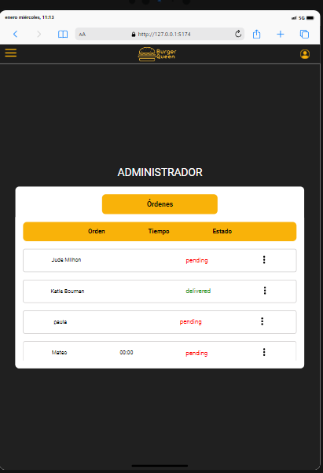
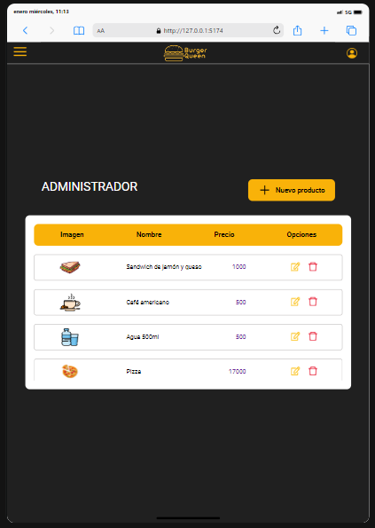
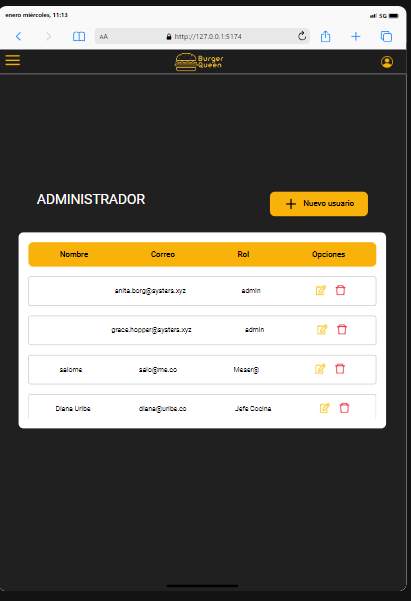
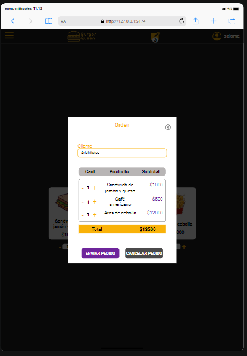
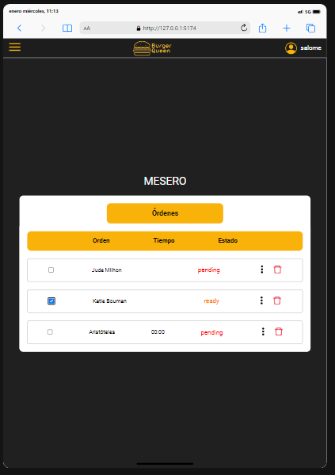
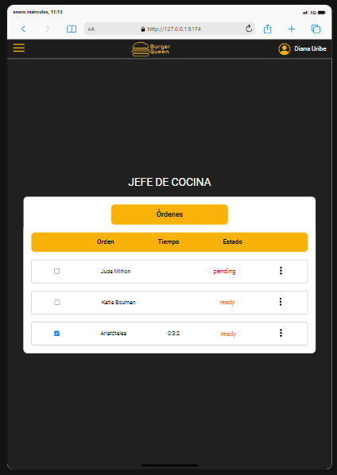

# Burger Queen

## Índice

* [1. Resumen del proyecto](#1-resumen-del-proyecto)
* [2. Pre-requisitos](#2-pre-requisitos)
* [3. Cómo utilizar la App](#3-cómo-utilizar-la-app)

***

## 1. Resumen del proyecto

Un pequeño restaurante de hamburguesas, que está creciendo, necesita un
sistema a través del cual puedan tomar pedidos usando una _tablet_, y enviarlos
a la cocina para que se preparen ordenada y eficientemente.

Esta es la información dxl clientx:

> Somos **Burguer Queen**, una cadena de comida 24hrs.
>
> Nuestra propuesta de servicio 24hrs ha tenido muy buena acogida y, para
> seguir creciendo, necesitamos un sistema que nos ayude a tomar los pedidos de
> nuestrxs clientxs.
>
> Tenemos 2 menús: uno muy sencillo para el desayuno y otro para el almuerzo y cena.
>
> Nuestrxs clientxs son bastante indecisos, por lo que es muy común que cambien
> el pedido varias veces antes de finalizarlo.
>La interfaz debe mostrar los dos menús (desayuno y resto del día), cada  uno
>con todos sus _productos_. La usuaria debe poder ir eligiendo qué _productos_
>agregar y la interfaz debe ir mostrando el _resumen del pedido_ con el
costo total.
>

## 2. Pre-requisitos  📋

***

#### [Historia de usuario 1] 🔒 Mesero/a debe poder ingresar al sistema, si el admin ya le ha asignado credenciales

Yo como meserx quiero poder ingresar al sistema de pedidos.

***

#### [Historia de usuario 2] 🍔 Administrador(a) de tienda debe administrar a sus productos

Yo como administrador(a) de tienda quiero gestionar los productos
para mantener actualizado el menú.

***

#### [Historia de usuario 3] 📝 Mesero/a debe poder tomar pedido de cliente/a

Yo como meserx quiero tomar el pedido de unx clientx para no depender de mi mala
memoria, para saber cuánto cobrar, y enviarlo a la cocina para evitar errores y
que se puedan ir preparando en orden.

***

#### [Historia de usuario 4] 👀 Jefe de cocina debe ver los pedidos

Yo como jefx de cocina quiero ver los pedidos de lxs clientxs en orden y
marcar cuáles están listos para saber qué se debe cocinar y avisar a lxs meserxs
que un pedido está listo para servirlo a un clientx.

***

#### [Historia de usuario 5] ♨ Meserx debe ver pedidos listos para servir

Yo como meserx quiero ver los pedidos que están preparados para entregarlos
rápidamente a lxs clientxs que las hicieron.

***

#### [Historia de usuario 6]  🤵👩🏽‍🍳 Administrador(a) de tienda debe administrar a sus trabajadorxs

Yo como administrador(a) de tienda quiero gestionar a los usuarios de
la plataforma para mantener actualizado la informacion de mis trabajadorxs.

***

## 3. Cómo utilizar la App

Para poder ingresar a la App   [_Burger Queen_](https://burgerqueen-app.netlify.ap) , el usuario debe desempeñar aluna función en el restaurante, para que el administrador le dé las credenciales respectivas, de acuerdo a su rol:

Si eres administrador/a 👩‍💼 puedes:
1. Crear, editar, eliminar y actualizar productos y usuarios
2. Puede ver el estado de las órdenes creadas por el mesero

 

*** 

Si eres mesera/o 🤵 puedes:
1. Crear, editar y eliminar órdenes
2. Actualizar el estado de la orden de listo a entregado al momento de llevárselo al cliente

 
  

*** 
Si eres jefe/a de cocina 👩🏽‍🍳 puedes:
1. Ver las órdenes creadas por el mesero
2. Actualizar el estado de la orden de pendiente a listo al momento de terminar la preparación
3. Ver cuánto tiempo tardó preparando la orden

 

*** 

🎉 ¡Esperamos disfrutes esta nueva experiencia, pensada para ustedes!

